# POS System

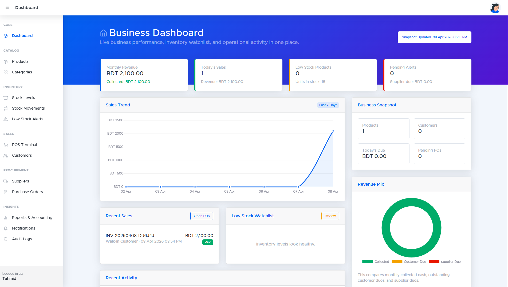

A professional Laravel-based Point of Sale and business management system for retail operations. The application combines POS checkout, inventory control, procurement, customer management, reporting, notifications, audit logging, and an admin dashboard in a single back-office workflow.

The default admin account from the seeder is:

- Email: `tahmid.tf1@gmail.com`
- Password: `12345678`


## Overview

This project is built for day-to-day store operations. It supports:

- product and category management
- stock tracking and stock movement history
- low stock monitoring and inventory controls
- supplier management and purchase orders
- customer management and loyalty tracking
- POS sales with mixed payment support
- promotions and discounts
- accounting snapshots and report exports
- admin notifications for operational events
- audit logs for business-critical changes

## Screenshots

### Dashboard


### Audit Logs

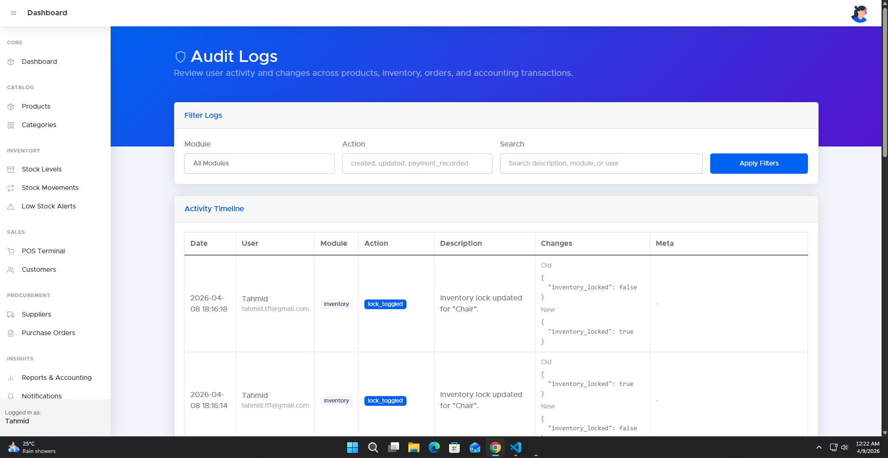

### Categories


### Customers

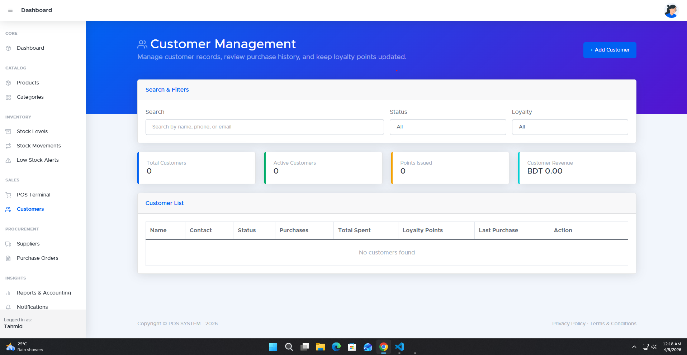

### Low Stock Alerts

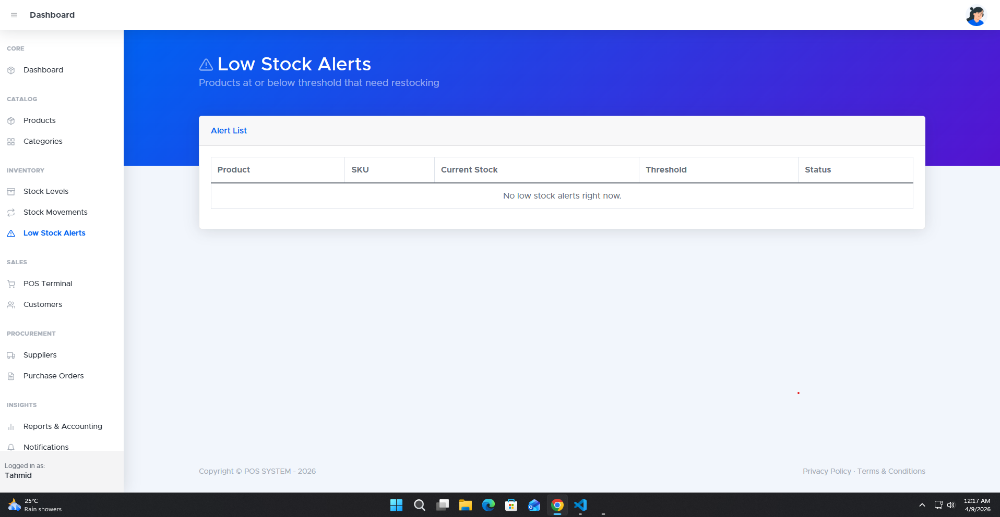

### Notifications

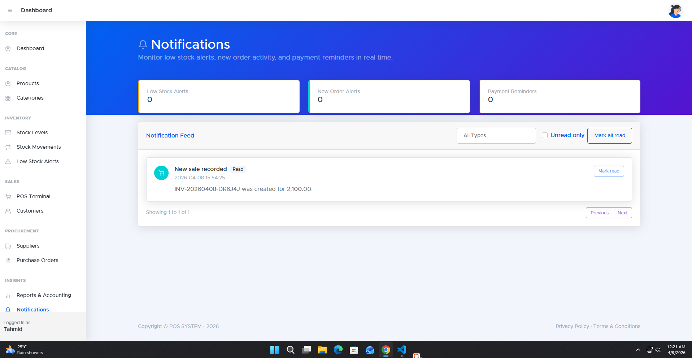

### POS Terminal

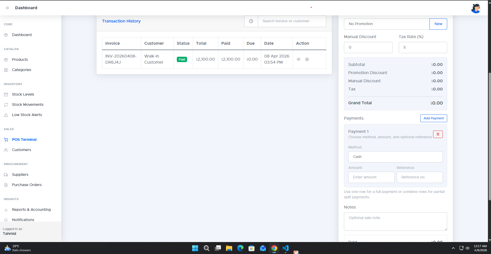

### Products

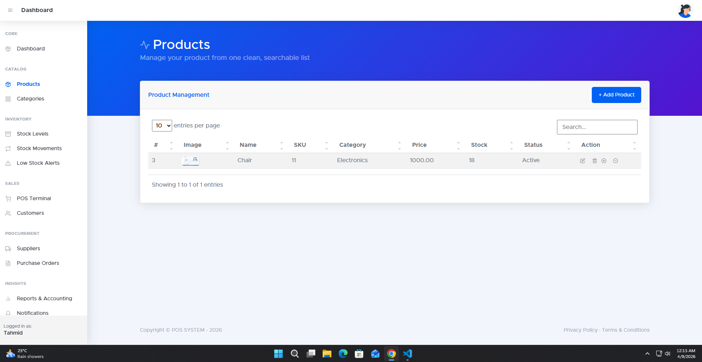

### Purchase Orders

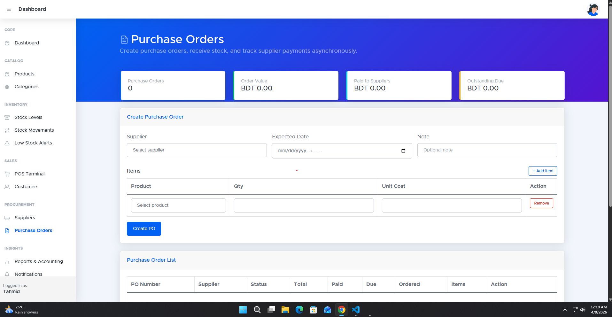

### Reporting And Basic Accounting

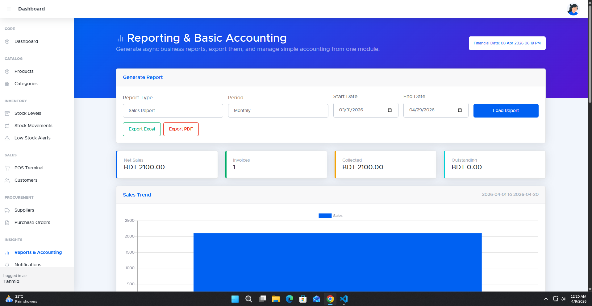

### Stock Levels

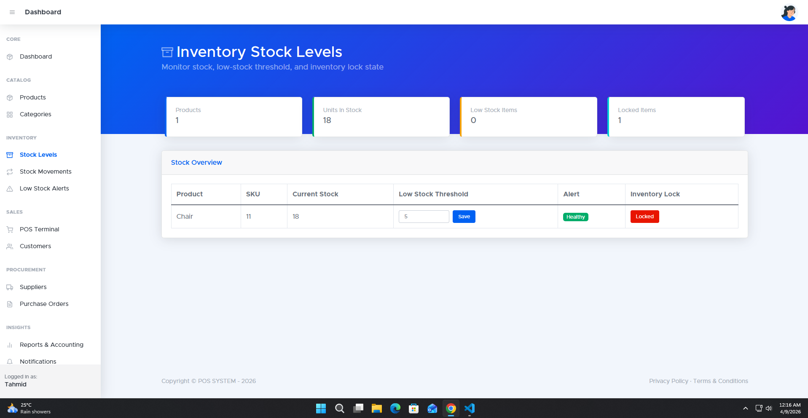

### Stock Movements

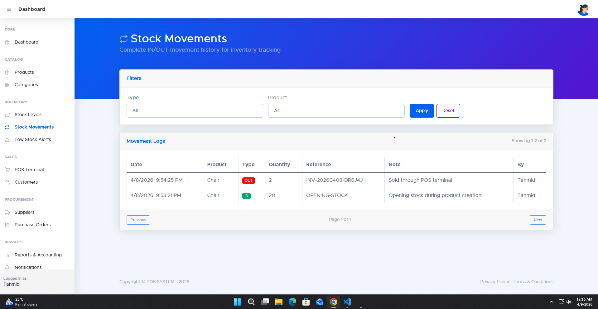

### Suppliers


## Core Modules

### Dashboard

The admin dashboard provides a live business snapshot with:

- monthly revenue and collected totals
- today's sales and outstanding dues
- low stock watchlist
- recent sales activity
- recent system notifications
- recent audit activity

### Catalog Management

- manage products with SKU, image, price, cost, category, status, and stock
- manage categories from the admin panel
- update inventory-related product settings such as low stock thresholds

### Inventory

- current stock level monitoring
- stock in and stock out operations
- stock movement history
- low stock alert screen
- optional stock locking to prevent overselling

### Sales / POS

- product search and cart-based checkout
- support for walk-in or saved customers
- manual discount and tax calculation
- promotion-based discounts
- mixed payment entry such as cash, card, and mobile
- invoice/receipt generation
- customer loyalty accumulation

### Customers

- create, update, and review customers
- purchase history lookup
- total spent tracking
- loyalty points tracking
- active/inactive customer status

### Suppliers and Procurement

- supplier directory
- purchase order creation
- receive purchase orders into inventory
- supplier payment recording
- payable balance tracking

### Reports and Accounting

- sales reports
- inventory reports
- profit and loss reporting
- cash flow reporting
- custom report ranges
- Excel export support
- accounting snapshot with ledger balances
- manual ledger and transaction entry

### Notifications

The system includes an operational notification center for:

- low stock alerts
- new order alerts
- payment reminders

Notifications are visible from the admin area and can be marked as read individually or in bulk.

### Audit Logging

Audit logs are recorded for important business actions, including:

- product changes
- stock adjustments
- sales operations
- purchase order updates
- supplier payment updates
- accounting activity

Admins can review logs from the audit log screen.

## Tech Stack

- Laravel 10
- PHP 8.1+
- Blade templates
- jQuery for async admin interactions
- Bootstrap-based admin UI
- Chart.js for dashboard visualizations
- Laravel Breeze for authentication
- Spatie Laravel Permission for roles
- Laravel Telescope
- Laravel Sanctum
- Laravel Excel
- Vite for frontend assets

## Authentication and Roles

You should change this password immediately in any real deployment.

## Installation

### 1. Clone the repository

```bash
git clone https://github.com/tahmid-tf/pos_system.git
cd pos_system
```

### 2. Install backend dependencies

```bash
composer install
```

### 3. Install frontend dependencies

```bash
npm install
```

### 4. Configure environment

```bash
cp .env.example .env
```

Update your database credentials inside `.env`.

### 5. Generate the application key

```bash
php artisan key:generate
```

### 6. Run migrations and seed the database

```bash
php artisan migrate --seed
```

### 7. Start the development servers

Backend:

```bash
php artisan serve
```

Frontend:

```bash
npm run dev
```

## Production Build

To build frontend assets for production:

```bash
npm run build
```

## Project Structure

Important areas in the codebase:

- `app/Http/Controllers`  
  Application business flows for dashboard, products, inventory, sales, suppliers, purchase orders, reports, notifications, and audit logs.

- `app/Models`  
  Eloquent models for products, stock, sales, payments, suppliers, ledgers, notifications, and audit logs.

- `app/Services`  
  Shared business services such as accounting, notifications, and audit logging.

- `resources/views/admin`  
  Admin panel Blade views for operational modules.

- `resources/views/dashboard`  
  Admin dashboard UI.

- `routes/admin.php`  
  Main authenticated admin routes.

- `database/migrations`  
  Database schema for POS, inventory, reporting, notifications, and audit logging.

## Development Notes

- Much of the admin interface is built with asynchronous jQuery/AJAX interactions for smoother CRUD workflows.
- The system uses modal-based forms heavily in the admin UI.
- Inventory changes are tied to stock movement records for traceability.
- Sales and purchase order flows update both operational and accounting records.
- Notifications and audit logs are integrated into the admin experience rather than being isolated modules.

## Security Notes

- The seeded admin password is for local setup only.
- Update environment secrets before deployment.
- Confirm database targets before running migrations in production.

## License

This project currently follows the repository's existing licensing setup. If you plan to distribute it publicly or commercially, add an explicit project license file and deployment policy.
